# Awesome Cloud Network Firewall 🛡️⚡

  
  
  
  
  
  
  

---

## 📌 Overview & SEO Summary 🔍

Welcome to **Awesome Cloud Network Firewall** 🚀! This repository is a community-curated collection of top-tier **Cloud Network Firewalls**, **Cloud-Native WAF/WAAP Solutions**, **Next-Generation Virtual Firewalls (NGFW)**, and **Production-Grade Open-Source Security Tools**. 

Whether you are designing multi-cloud network architectures, securing AWS VPCs, Azure VNets, or Google Cloud workloads, or deploying open-source firewalls like OPNsense and pfSense, this guide provides comparative insights, baseline pricing, free tier details, and company sizing metrics.

---

## 📖 Table of Contents 📜

- [☁️ SaaS & Hosted Firewall Platforms](#️-saas--hosted-firewall-platforms)
- [🔓 Open-Source Firewall & Security Projects](#-open-source-firewall--security-projects)
- [🤝 How to Contribute](#-how-to-contribute)
- [💖 Support & Sponsorship](#-support--sponsorship)
- [⭐ Star History](#-star-history)
- [⚠️ Disclaimer](#️-disclaimer)

---

## ☁️ SaaS & Hosted Firewall Platforms ☁️

> **📊 Market Size & Industry Structure**: The global enterprise cloud network firewall market is estimated at **~$15.8 Billion in 2026** and projected to expand at a **13.68% CAGR** through 2031. The sector is **moderately concentrated** — hyperscale cloud providers (AWS, Microsoft Azure, Google Cloud) dominate native cloud VPC protection, while established cybersecurity giants (Cisco, Palo Alto Networks, Fortinet, Check Point) lead virtual NGFW appliances. There is no single "winner-take-all" vendor, as enterprise architectures predominantly deploy hybrid model stacks.

| Platform | Description | Pricing (Starting Tier) | Free Tier Limits | Company Size (Revenue / Valuation) |
| :--- | :--- | :--- | :--- | :--- |
| **[AWS Network Firewall](https://aws.amazon.com/network-firewall/)** | Managed, cloud-native firewall for VPC protection with stateful inspection & IPS. | **$0.395/hour per endpoint** + $0.065/GB processed | **30-day Free Trial** ($200 AWS credit for new accounts) | **~$638B revenue** (Amazon FY2025) 📈 |
| **[Google Cloud Armor](https://cloud.google.com/armor)** | DDoS protection and Layer 7 WAF for Google Cloud workloads with ML protection. | **$0.75/rule/month** + $0.05/GB processed | **90-day Free Trial** ($300 GCP credit for new accounts) | **~$350B revenue** (Alphabet FY2025) 📈 |
| **[Azure Firewall](https://azure.microsoft.com/en-us/products/azure-firewall/)** | Cloud-native firewall with threat intelligence, FQDN filtering & central policy. | **$0.016/hour** (~$11.52/month) + data processing | **30-day Free Trial** ($200 Azure credit for new accounts) | **~$281B revenue** (Microsoft FY2025) 📈 |
| **[Cisco Secure Firewall](https://www.cisco.com/)** | Enterprise NGFW with Snort 3 IPS, URL filtering, and advanced malware protection. | **$1,136 starting cost** (CSF220-TD-K9 appliance) | **30-day Free Trial** (Virtual Firewall evaluation license) | **~$63B revenue** (Cisco FY2025) 🏢 |
| **[Palo Alto VM-Series](https://www.paloaltonetworks.com/)** | Virtualized next-gen firewall (NGFW) with full PAN-OS threat prevention features. | **$1.15/hour** (PAYG on AWS/Azure Marketplace) | **30-day Free Trial** (Palo Alto Cloud Marketplace trial) | **~$9.2B revenue** (Palo Alto Networks FY2025) 🛡️ |
| **[Fortinet FortiGate-VM](https://www.fortinet.com/)** | Virtualized NGFW powered by FortiOS with multi-cloud automation. | **$1,500/year** (Starting tier FortiGate-VM01 license) | **15-day Free Trial** (FortiGate-VM evaluation license) | **~$5.5B revenue** (Fortinet FY2025) 🛡️ |
| **[Check Point CloudGuard](https://www.checkpoint.com/)** | Cloud-native network security with NGFW, threat prevention & posture management. | **$0.65/hour** (PAYG listing starting tier) | **30-day Free Trial** (CloudGuard Network Security trial) | **~$2.5B revenue** (Check Point FY2025) 🛡️ |
| **[Sophos XG Firewall](https://www.sophos.com/)** | Synchronized security firewall with Xstream architecture & deep packet inspection. | **$200/year** (Sophos Home / XGS Virtual starting license) | **30-day Free Trial** (Full Guard trial license) | **~$700M revenue** (Sophos Enterprise est.) 🔒 |
| **[SonicWall NSv](https://www.sonicwall.com/)** | Virtual firewall for public/private cloud with RFDPI threat prevention engine. | **$2,018/year** (NSv 270 starting tier 1-year license) | **30-day Free Trial** (NSv virtual evaluation license) | **~$500M revenue** (SonicWall Private est.) 🔒 |
| **[Barracuda CloudGen Firewall](https://www.barracuda.com/)** | Cloud-optimized virtual firewall with multi-link SD-WAN integration. | **$67.82/month** (Remote Access / Level 1 Virtual Instance) | **30-day Free Trial** (Barracuda AWS/Azure trial) | **~$500M revenue** (Barracuda Private est.) 🔒 |

---

## 🔓 Open-Source Firewall & Security Projects 🔓

Sorted by star count (descending). Star badges link directly to each repository's stargazers page.

| Repo | Description | Stars |
| :--- | :--- | :--- |
| **[CrowdSec](https://github.com/crowdsecurity/crowdsec)** | Collaborative IPS/IDS with WAF engine. Analyzes behavior and leverages crowd intelligence to block attacks. |  |
| **[ModSecurity](https://github.com/owasp-modsecurity/ModSecurity)** | The legendary open-source Web Application Firewall (WAF) engine for HTTP traffic monitoring and filtering. |  |
| **[OpenSnitch](https://github.com/evilsocket/opensnitch)** | GNU/Linux interactive application firewall inspired by Little Snitch. Outbound connection control & process filtering. |  |
| **[Portmaster](https://github.com/safing/portmaster)** | Privacy-focused network monitor and application firewall. Blocks mass surveillance & handles DNS filtering. |  |
| **[Suricata](https://github.com/OISF/suricata)** | High-performance open-source Network Threat Detection, IDS, IPS, and Network Security Monitoring engine. |  |
| **[BunkerWeb](https://github.com/bunkerity/bunkerweb)** | Open-source WAF/WAAP platform. Features OWASP Top 10 defense, antibot, rate limiting, and SSL offloading. |  |
| **[OPNsense](https://github.com/opnsense/core)** | Full-featured open-source Next-Generation Firewall & routing platform based on FreeBSD. |  |
| **[pfSense](https://github.com/pfsense/pfsense)** | Highly popular open-source firewall & router distribution providing enterprise-grade perimeter protection. |  |
| **[VyOS](https://github.com/vyos/vyos-1x)** | Open-source network operating system offering unified routing, stateful firewalling, and VPN capabilities. |  |
| **[IPFire](https://github.com/ipfire/ipfire-2.x)** | Modular, easy-to-use Linux firewall distribution designed for high-security infrastructure network guard. |  |

---

## 🤝 How to Contribute 🤝

1. Fork the repository. 🍴
2. Add or update entries in `README.md` following the table formatting. ✍️
3. Provide accurate pricing, free trial details, company size, or open-source star links. 📊
4. Open a Pull Request with a short summary of changes. 🚀

---

## 💖 Support & Sponsorship ☕

If you find this repository useful for your cloud security research, network planning, or DevOps architecture:

- ⭐ **Star** this repository to show support!
- 🔀 **Fork** it to keep a copy or contribute updates.
- 📢 **Share** it with fellow network engineers, security architects, and platform teams!
- ☕ **Buy me a coffee**: Support ongoing open-source maintenance via the [GitHub Sponsor Dashboard](https://github.com/sponsors/ishandutta2007).

Thank you for supporting open cloud security tools! ❤️

---

## ⭐ Star History 📈

---

## ⚠️ Disclaimer ⚠️

- This is a **community-curated** list — not exhaustive and not an official endorsement.
- Cloud firewalls handle sensitive network traffic and security policies; ensure proper configuration, logging, and compliance with organizational security requirements.
- **Open-Source Reality**: Open-source options (e.g. OPNsense, pfSense, VyOS) provide production-grade security for self-hosted virtual appliances or on-premises perimeter routing. However, cloud-native managed firewalls (AWS Network Firewall, Azure Firewall, GCP Cloud Armor) provide deeply integrated VPC/VNet orchestration and global DDoS resilience that require custom engineering to match.
- **Pricing & Trial Note**: All prices and trial metrics are derived from vendor listings and market reports as of 2026. Vendor pricing tiers and trial parameters are subject to change. Always verify directly with the respective cloud vendor.

---

  <b>Made with ❤️ for network security engineers, cloud architects, and SecOps teams worldwide.</b>

